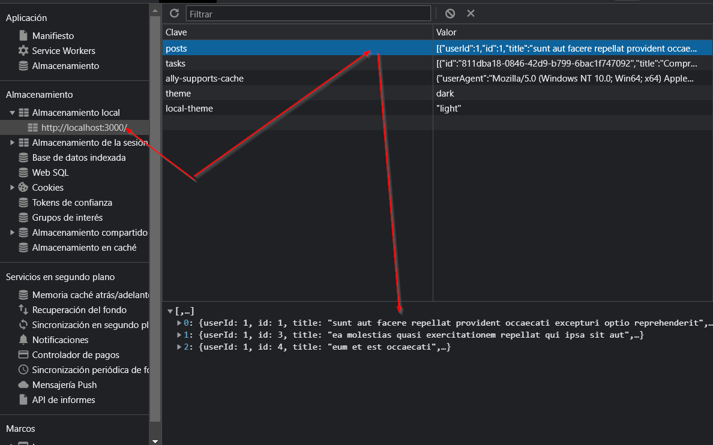

# Listado de posts

Proyecto creado a partir de [este API](https://jsonplaceholder.typicode.com/posts)

## Uso

Instalar y ejecutar, después de descargar repositorio, con los siguientes comandos:

```bash
npm i
npm run dev
```

Correr [http://localhost:3000](http://localhost:3000) para probar.

## Consideraciones

* La sesión con las credenciales admin/admin se guarda en una cookie con clave "token" y valor "Bearer":


* Los posts son almacenados en localStorage:



## Herramientas

* Next.js
* Bootstrap 5.3
* Redux Toolkit
